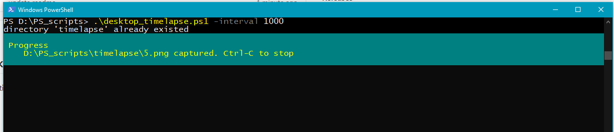

## Powershell script to make timelapsed screenshot of windows-desktop. 
Basically, does a screenshot in every time interval. Chose your own timelapse creator to create timelapse video, [this](https://www.microsoft.com/en-us/p/time-lapse-creator/9p7tv6jcl1s3) app for example.

## Use on your own risk
Not tested on many difference machines. Script may fail because of its dependency on the .NET.

## Usage example
```
PS D:\PS_scripts> .\desktop_timelapse.ps1 -interval 1000
```

The script will make a directory called timelapse, and put all the screenshots inside this directory.

## Credit 
Adopted script from https://stackoverflow.com/a/44609221

# Good Luck, Have fun :)