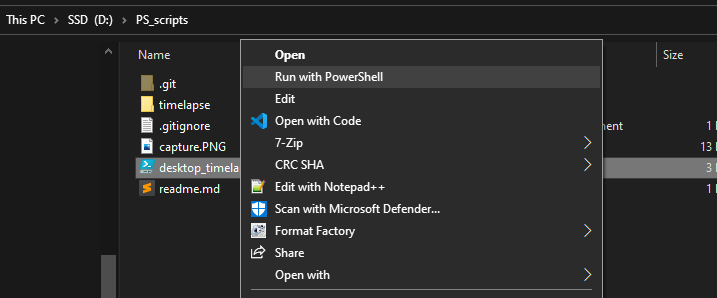
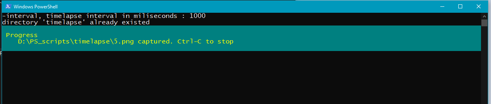
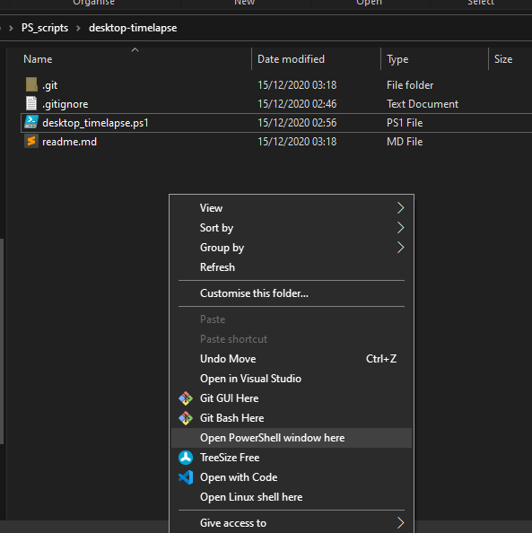
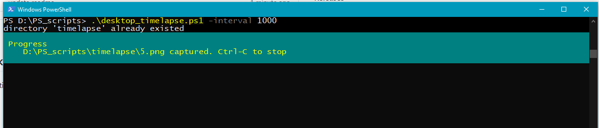
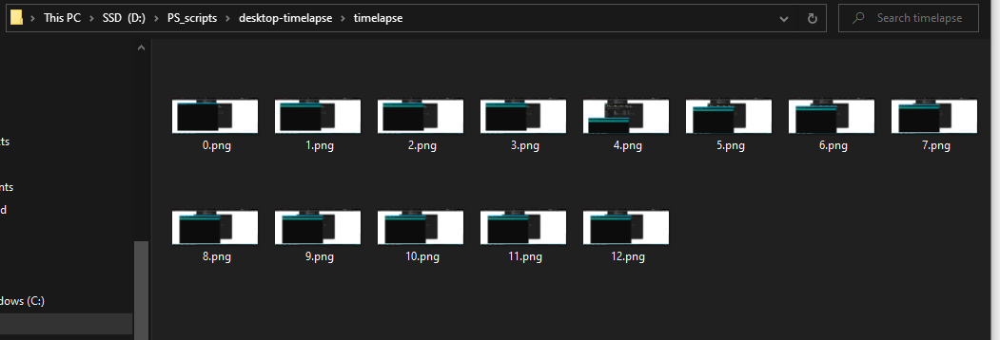

## Powershell script to make timelapsed screenshot of windows-desktop. 
Basically, does a screenshot in every time interval. Chose your own timelapse creator to create timelapse video, [this](https://www.microsoft.com/en-us/p/time-lapse-creator/9p7tv6jcl1s3) app for example.

## Use on your own risk
Not tested on many different machines. Script may fail because of its dependency on the .NET.

## Usage example
### option 1
1. Right-click on the script, select "Run with powershell".
&nbsp;&nbsp;
2. A powershell window will popped up, you will be prompted to input the interval value.
&nbsp;&nbsp;
3. Use Ctrl-C to stop timelapsing.

### option 2
1. Shift + Righ-click on blank area inside script's directory, select "open powershell window here".
&nbsp;&nbsp;
2. run this command: 
&nbsp;&nbsp;```.\desktop_timelapse.ps1 -interval 1000```
Use your own interval value, in this example we use 1000 milisecond.
&nbsp;&nbsp;
3. Use Ctrl-C to stop.

### output
The script will make a directory called timelapse, and put all the screenshots inside this directory.
&nbsp;&nbsp;

## Credit 
This script is adopted from https://stackoverflow.com/a/44609221. I only add the timelapse logic.

# Good Luck, Have fun :)